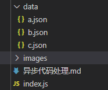

# JS异步代码处理

> 以 NodeJs 读取文件为例 

​	在index 同级目录下新建三个文件 a.json b.json c.sjon



三个文件都为 json 格式，内容分别如下

```json
// a.json
{
  "message": "这是a的数据",
  "next": "b.json"
}

// b.json
{
  "message": "这是b的数据",
  "next": "c.json"
}

// c.json
{
  "message": "这是c的数据",
  "next": "null"
}
```

现在想要在index中逐步获取 a.json 拿到a.json 后通过返回值中的 next 属性获取下一个文件中的数据，以此类推直至获取三个文件中的全部数据


## 读取文件核心模块

- fs
  - `const fs = require('fs')` 使用 node 的核心模块 fs 可以对本地文件进行读取写入等操作
  - fs.readFile 读取数据 传入文件路径以及回调操作，如果成功返回 data（第二个参数） 失败返回 error（第一个参数) 
- path
  - `const path = require('path')` path 模块用以处理文件路径
  -  path.resolve() 方法将给定的参数 从右向左逐步处理，直至构造出一个绝对路径
  - __dirname 总是指向被执行 js 文件的绝对路径


### 回调函数处理异步

- 回调函数处理异步是一种轮询的方式进行
  - 当任务执行完毕后再调用回调函数

```javascript
function getFileContent(filename, callback) {
  // 获取数据文件的绝对路径
  const fullFilename = path.resolve(__dirname, 'data', filename);

  fs.readFile(fullFilename, (err, data) => {
    if(err) {
      console.error(err)
      return
    }
    callback && callback(
      JSON.parse(data.toString())
    )
  })
}

getFileContent('a.json', (aData) => {
  onsole.log('aData', aData)
  getFileContent(aData.next, (bData) => {
    console.log('bData', bData)
    getFileContent(bData.next, (cData) => {
      console.log('cData', cData)
    })
  })
})
```

回调函数层层嵌套调用被称为 **回调地狱**

- 可读性低
- 难以维护


### Promise 处理异步

- Promise 在使用时需要创建实例 
  - promise有两个处理方法 resolve 和 reject 
    - resolve 将promise 从 padding 状态改变为成功状态
    - reject 将promise 从 padding 状态改为失败状态
- 在方法最后 return 创建的实例化对象 可以实现链式编程

```javascript
function getFileContent(filename) {
  const promise = new Promise((resolve, reject) => {
    // 文件绝对路径
    const fullFilename = path.resolve(__dirname, 'data', filename);

    fs.readFile(fullFilename, (err, data) => {
      if (err) {
        reject(err)
        return
      }
      resolve(JSON.parse(data.toString()))
    })
  })
  return promise
}

getFileContent('a.json')
.then(aData => {
  console.log('aData', aData)
  return getFileContent(aData.next)
}).then(bData => {
  console.log('bData', bData)
  return getFileContent(bData.next)
}).then(cData => {
  console.log('cData', cData)
})	
```

1. 使用 Promise 处理不需要接收回调函数，只需要在 .then中接收返回值
2. 使用 Promise 最多只有两层 
3. 链式编程需要将 Promise 对象返回 也就是代码的 `return getFileContent(aData.next)`
   - 此方法的返回值为 promise 


### 总结

 两种异步代码的处理返回结果相同

```javascript
aData { message: '这是a的数据', next: 'b.json' }
bData { message: '这是b的数据', next: 'c.json' }
cData { message: '这是c的数据', next: 'null' }
```

但两者在实现上大相径庭，相比之下 Promise 的实现更为简洁方便，可读性高，维护性好

👉 [获取代码](https://github.com/XXXieChenHao/Node/tree/master/promise-demo)


【😊 转载请注明出处链接】


